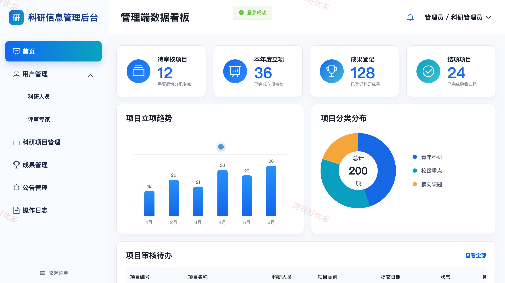
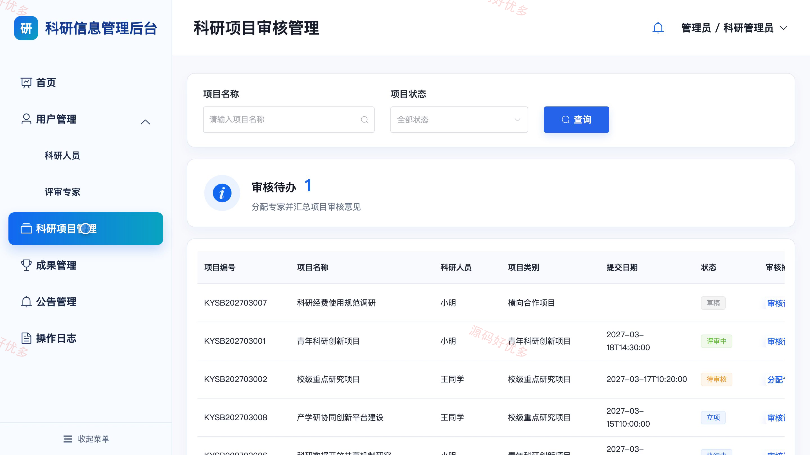
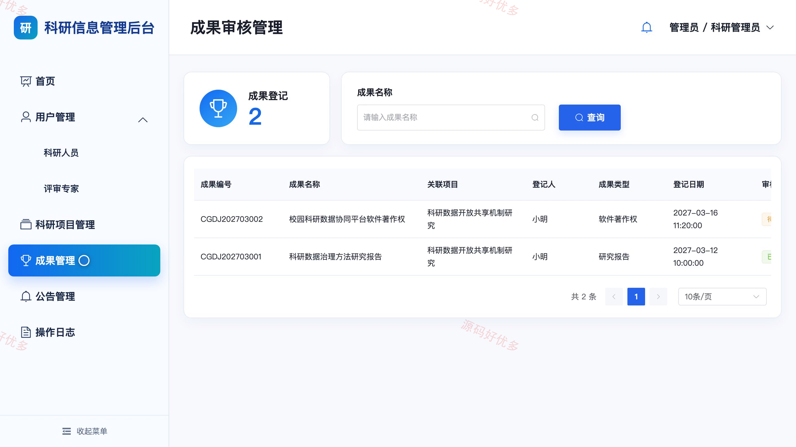
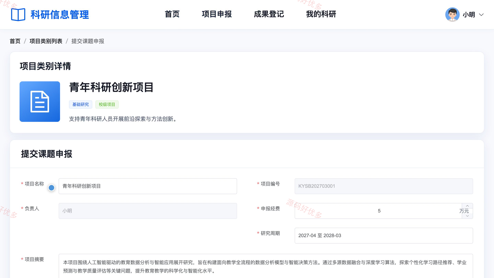
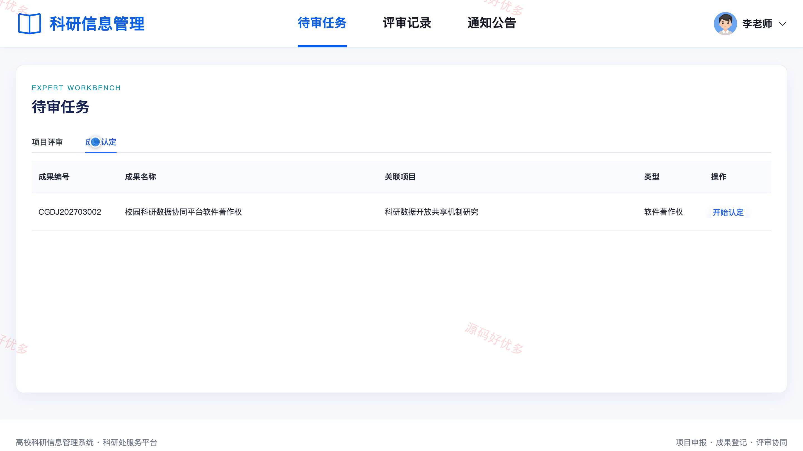

# bs051A
bs051A高校科研信息管理系统
## 源码问题查看主页咨询

### 一、关键词
高校科研管理、科研项目申报、项目评审、科研成果认定、学术项目管理

### 二、作品包含
源码+数据库+全套环境和工具资源+本地部署教程

### 三、项目技术
前端技术： Html、Css、Js、Vue3.4、Element-Plus
后端技术：Java、SpringBoot3.2.0、MyBatis-Plus

### 四、运行环境（以下版本亲测，其他版本兼容性请自行测试）
开发工具：IDEA/eclipse + VSCODE

数据库：MySQL5.7+（共10张表）

数据库管理工具：Navicat10以上版本

环境配置软件： JDK17 + Maven

前端Nodejs：16+

浏览器：谷歌浏览器

### 五、项目介绍
项目编号：bs051A

高校科研信息管理系统面向科研人员、评审专家和管理员，围绕项目申报、过程跟踪、专家评审、成果登记与认定等业务形成协同管理流程。

角色：科研人员、评审专家、管理员

科研人员功能：通知公告查看、申报类别与要求查看、科研项目草稿保存与提交、个人项目查询与状态跟踪、项目进度填报、科研成果登记与查询、个人资料维护、登录密码修改。

评审专家功能：通知公告查看、项目评审任务查看、项目评审结论与意见提交、成果认定任务查看、成果认定结论与意见提交、历史评审记录查询、个人资料维护、登录密码修改。

管理员功能：科研数据看板、科研人员与评审专家账号管理、项目审核与专家分配、科研成果认定管理、项目分类管理、通知公告管理、操作日志查看、个人资料维护。

### 六、运行截图

